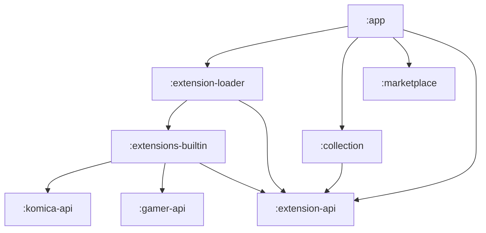

# NewsHub

一個整合多個討論板的 Android 閱讀器，讓你在同一個地方瀏覽 Komica、巴哈姆特等論壇的最新貼文。

---

## 功能介紹

### 訂閱你喜歡的板塊

從內建的論壇來源中選擇你感興趣的板塊，加入訂閱清單，隨時掌握最新動態。

### 建立個人化的收藏集

將不同論壇的板塊組合成一個「收藏集」，例如把 Komica 的動漫板和巴哈姆特的遊戲板放在一起，用單一時間軸瀏覽所有內容。

### 閱讀貼文與留言

- 支援點擊預覽引用內容（例如 >>12345678）
- 以樹狀結構瀏覽留言串
- 點擊圖片放大查看、播放影片

### 擴充套件系統

除了內建支援的論壇，你也可以從擴充套件商城安裝社群提供的第三方來源，擴充 NewsHub 支援的論壇範圍。

---

## 支援的論壇

| 來源           | 板塊            |
|--------------|---------------|
| Komica       | 綜合、2cat 等多個板塊 |
| 巴哈姆特 (Gamer) | 多個哈啦板         |
| 第三方擴充套件      | 透過擴充套件商城安裝    |

---

## 安裝方式

1. 前往 [Releases](../../releases) 頁面
2. 下載最新版本的 `.apk` 檔案
3. 在手機上開啟 `.apk` 並允許安裝未知來源的應用程式

---

## 開始使用

1. **建立收藏集** — 開啟側邊選單，點擊右上方的 + 號，新增一個 Collection，並在其中加入 Boards。
2. **開始閱讀** — 在收藏集的時間軸上瀏覽所有訂閱板塊的最新貼文

---

## Roadmap

- 閱讀歷史
- 收藏貼文
- 追蹤文章更新
- 依關鍵字個人化推薦
- 發文功能
- 資料備份與還原

---

## 開發者資訊

模組架構

| 模組                    | 說明                                                               |
|-----------------------|------------------------------------------------------------------|
| `:extension-api`      | 公開介面：`Source`、資料模型（`Board`、`ThreadSummary`、`Post`、`Paragraph` 等） |
| `:extensions-builtin` | 內建的 Komica（Sora、2cat）與巴哈姆特實作                                     |
| `:komica-api`         | Komica HTML 解析器與 HTTP 客戶端                                        |
| `:gamer-api`          | 巴哈姆特 HTML 解析器與 HTTP 客戶端                                          |
| `:extension-loader`   | 載入內建與 APK 形式的擴充套件，提供 `ExtensionLoader`                           |
| `:collection`         | Room 資料庫，管理使用者定義的收藏集與板塊訂閱                                        |
| `:marketplace`        | 以 GitHub 為基礎的擴充套件商城：索引抓取、APK 下載、安裝狀態追蹤                           |
| `:app`                | UI（Jetpack Compose）、導航、Hilt 依賴注入                                 |

