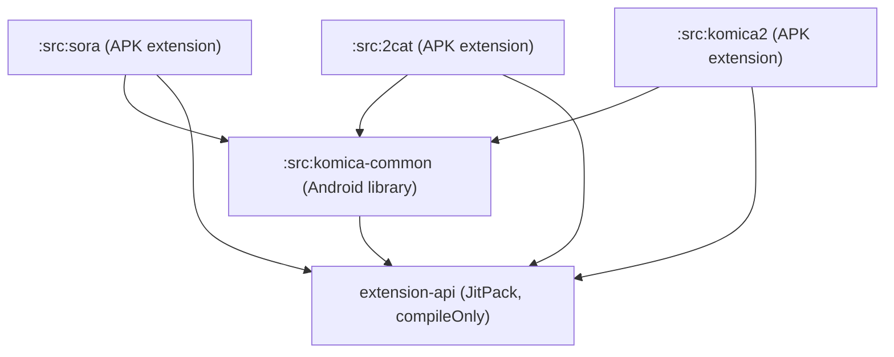
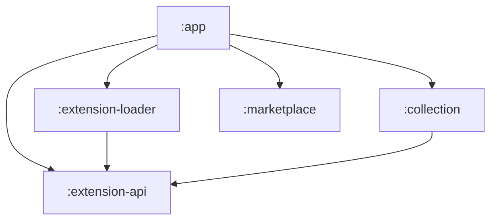

# Komica Extension Migration Design

**Date:** 2026-04-14  
**Status:** Approved  
**Scope:** 將 `komica-api` 與 `extensions-builtin` 從 NewsHub 移至 extensions-source repo，成為三個獨立 APK extensions

---

## 目標

- NewsHub app 不再包含任何內建 Source 實作，所有 Source 均透過 APK extension 機制提供
- 刪除 `komica-api` 與 `extensions-builtin` 兩個模組
- 移除 `extension-loader` 的 `builtInSources` 機制
- extensions-source 新增 `komica-common` 共享 library 與三個薄 extension（sora、2cat、komica2）

---

## extensions-source 側

### 模組結構

```
extensions-source/
└── src/
    ├── gamer/              (現有，不動)
    ├── komica-common/      (新增 Android library)
    │   ├── build.gradle.kts
    │   ├── README.md
    │   └── src/main/java/tw/kevinzhang/komica_api/
    │       (搬移自 NewsHub :komica-api 所有 .kt 原始碼)
    ├── sora/               (新增 APK extension)
    ├── 2cat/               (新增 APK extension)
    └── komica2/            (新增 APK extension)
```

### komica-common 模組

- plugin: `com.android.library`（不使用 `common.gradle`，那是 APK extension 用的）
- 直接搬移 NewsHub `komica-api/src/main/java/` 下的全部代碼，package 名稱維持 `tw.kevinzhang.komica_api`
- 依賴：`compileOnly 'com.github.twkevinzhang.NewsHub:extension-api:<commit>'`、okhttp、jsoup、coroutines-okhttp
- 附 `README.md`，含依賴圖（見下方）與 trade-off 說明

### komica-common/README.md 依賴圖



> **Trade-off 說明（README 中撰寫）：**  
> 三個 extension APK 各自 bundle komica-common，意味著每個 APK 裡都有一份 komica-api 代碼的副本（約 35 個 .kt 檔）。這是刻意的選擇：讓每個 extension 可以獨立版本演進、獨立發佈，不需要協調 shared library 的版本。若未來 komica-common 與 extension 需要 API 不相容的演進，分拆成不同 fork 更容易。代價是三個 APK 各大約數十 KB，可接受。

### 三個薄 extension

每個 extension 的 `build.gradle.kts` 格式：

```kotlin
ext {
    set("extName", "NewsHub: <name>")
    set("extClass", ".<ClassName>")
    set("extVersionCode", 1)
    set("extVersionName", "0.0.1")
}
apply(from = "$rootDir/common.gradle")

dependencies {
    implementation(project(":src:komica-common"))
}
```

搬移的 Source 類別：

| Extension | Source 類別 | Source id |
|-----------|------------|----------|
| `src/sora/` | `SoraSource` | `tw.kevinzhang.komica-sora` |
| `src/2cat/` | `_2catSource` | `tw.kevinzhang.2cat` |
| `src/komica2/` | `Komica2Source` | `tw.kevinzhang.komica2` |

`ParagraphMapper.kt`（`KParagraph` → `ExtParagraph`）隨 komica-common 一起搬移，供三個 Source 共用。

### settings.gradle.kts 調整

目前的動態掃描邏輯只 include 有 `build.gradle.kts` 的子目錄。`komica-common` 同樣有 `build.gradle.kts`，但它是 library 而非 APK extension，需在自動掃描之前手動 include：

```kotlin
include(":src:komica-common")
project(":src:komica-common").projectDir = File(rootDir, "src/komica-common")

// 動態 include APK extensions（排除 komica-common）
File(rootDir, "src").takeIf { it.isDirectory }?.listFiles()
    ?.filter { it.isDirectory && File(it, "build.gradle.kts").exists() && it.name != "komica-common" }
    ?.forEach { dir ->
        val moduleName = ":src:${dir.name}"
        include(moduleName)
        project(moduleName).projectDir = dir
    }
```

---

## NewsHub 側

### 要刪除的模組

| 模組 | 動作 |
|------|------|
| `komica-api/` | 整個目錄刪除 |
| `extensions-builtin/` | 整個目錄刪除 |

### 要修改的檔案

**`settings.gradle`** — 移除兩行：
```groovy
// 刪除：
include ':komica-api'
include ':extensions-builtin'
```

**`extension-loader/build.gradle`** — 移除：
```groovy
// 刪除：
implementation project(':extensions-builtin')
```

**`extension-loader/di/ExtensionModule.kt`** — 移除 `provideBuiltInSources` companion object 及相關 import；`bindExtensionLoader` 保留：

```kotlin
@Module
@InstallIn(SingletonComponent::class)
abstract class ExtensionModule {
    @Binds
    @Singleton
    abstract fun bindExtensionLoader(impl: ExtensionLoaderImpl): ExtensionLoader
}
```

**`extension-loader/ExtensionLoaderImpl.kt`** — 移除 `@Named("builtInSources")` 建構子參數，`sourcesFlow` 只從 `extensionManager.installedExtensions` 來：

```kotlin
@Singleton
class ExtensionLoaderImpl @Inject constructor(
    @ApplicationContext private val context: Context,
    private val okHttpClient: OkHttpClient,
    private val extensionManager: ExtensionManager,
) : ExtensionLoader {
    override val sourcesFlow: StateFlow<List<Source>> = extensionManager.installedExtensions
        .map { installed ->
            installed.flatMap { it.sources }.onEach { it.onAttach(okHttpClient) }
        }
        .stateIn(scope, SharingStarted.Eagerly, emptyList())
    ...
}
```

### NewsHub README.md 模組圖更新

移除 `:komica-api`、`:extensions-builtin`、`:gamer-api` 節點與相關箭頭，保留：



---

## 執行順序

1. **extensions-source**：建立 `komica-common` 模組，搬移代碼
2. **extensions-source**：建立 `sora`、`2cat`、`komica2` 三個 extension，搬移 Source 類別
3. **extensions-source**：更新 `settings.gradle.kts`
4. **NewsHub**：修改 `ExtensionLoaderImpl` 與 `ExtensionModule`
5. **NewsHub**：更新 `extension-loader/build.gradle`
6. **NewsHub**：更新 `settings.gradle`，刪除兩個模組目錄
7. **NewsHub**：更新 `README.md` 的模組圖

---

## 不在本次範圍內

- `extension-api` 發布新版本至 JitPack（komica-common 使用現有 commit hash）
- CI/CD 簽名設定（Task 1-3/1-4，另案處理）
- Marketplace 測試 komica extensions 的安裝流程（另案驗收）
